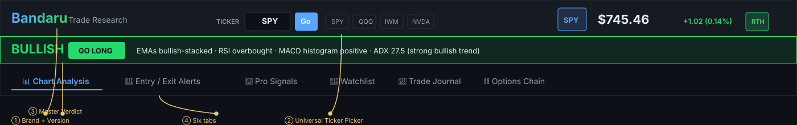
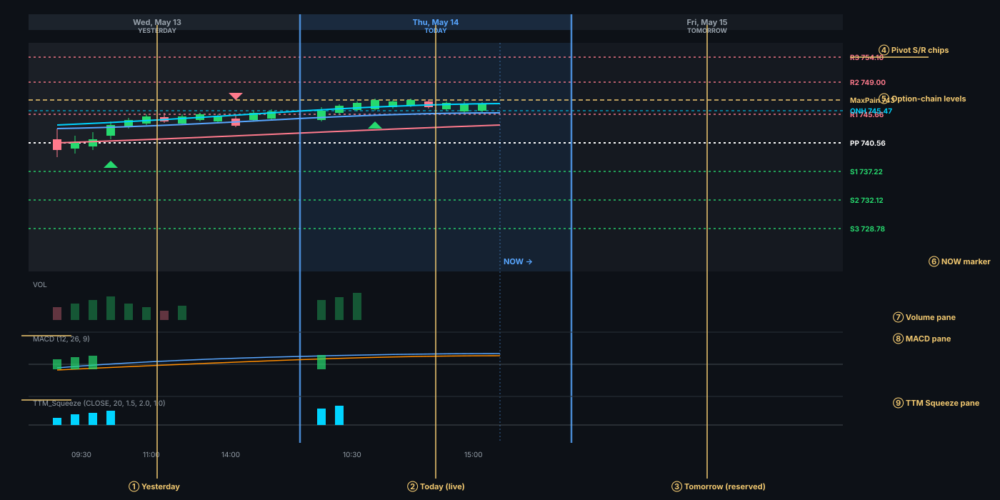
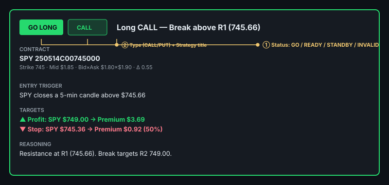
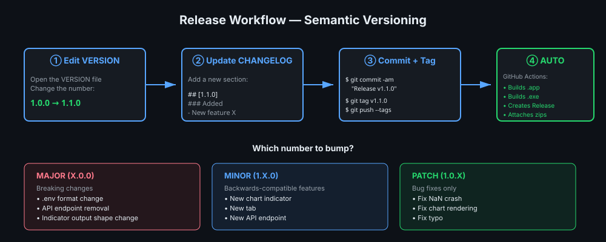

# Bandaru Trade Research — Product Guide

**Version:** 1.0.0 · [Changelog](CHANGELOG.md) · [Build](BUILD.md) · [Push](PUSH_TO_GITHUB.md)

A comprehensive day-trading analysis dashboard for SPY 0DTE options. This guide walks through every screen and feature with annotated visuals.

---

## Table of contents

1. [Installation & first launch](#installation--first-launch)
2. [Header anatomy](#header-anatomy)
3. [Chart Analysis tab](#chart-analysis-tab)
4. [Entry / Exit Alerts tab](#entry--exit-alerts-tab)
5. [Pro Signals tab](#pro-signals-tab)
6. [Watchlist tab](#watchlist-tab)
7. [Trade Journal tab](#trade-journal-tab)
8. [Options Chain tab](#options-chain-tab)
9. [Version & release workflow](#version--release-workflow)
10. [Glossary](#glossary)

---

## Installation & first launch

### macOS

1. Double-click **`start-app.command`** in the project folder (or use the `bandaru start` CLI if installed)
2. Safari opens automatically to `http://127.0.0.1:5000`
3. The dashboard loads with the default ticker (**SPY**), 3-day chart view, and 10-second auto-refresh

### Windows

1. Double-click **`Bandaru Trade Research.exe`** in the unzipped distribution folder
2. Your default browser opens to `http://127.0.0.1:5000` automatically
3. Same dashboard layout

### First-run setup

- **Yahoo data** (default if no Schwab token): works immediately, ~15-min delayed quotes, no auth needed
- **Schwab real-time data**: edit `.env` with your `SCHWAB_API_KEY` + `SCHWAB_APP_SECRET`, then run `bandaru auth` (or double-click `auth-schwab.command`). Browser OAuth flow takes ~30 seconds. After that, refresh tokens auto-renew for 7 days.

---

## Header anatomy

The top of the dashboard contains four control regions:



| # | Region | Purpose |
|---|---|---|
| ① | **Brand + Version** | Identifies the platform. The version chip in the footer (v1.0.0) tells you exactly which build is running. |
| ② | **Universal Ticker Picker** | Type any ticker → Go. Quick-preset buttons for SPY, QQQ, IWM, NVDA, TSLA, AAPL. |
| ③ | **Master Verdict** | One-line synthesis combining EMA stack + RSI + MACD + ADX. Color-coded BULLISH/BEARISH/MIXED. The colored action button (GO LONG / GO SHORT / WAIT) is the headline recommendation. |
| ④ | **Six tabs** | Click to switch context: Chart Analysis · Entry/Exit Alerts · Pro Signals · Watchlist · Trade Journal · Options Chain. |

**Right side of header (not pictured):** Auto-refresh checkbox + interval dropdown (2s / 5s / 10s / 30s), Alerts toggle (desktop notifications + chime), and a manual Refresh button.

---

## Chart Analysis tab

The flagship view. Multi-pane technical chart with full session context.



| # | Element | Description |
|---|---|---|
| ① | **Yesterday zone** | Last trading day's intraday bars. Gray background. Real date in the header strip. |
| ② | **Today zone (live)** | Today's bars as they print. Blue-tinted background. Real date in the header strip. |
| ③ | **Tomorrow zone (reserved)** | Empty space reserved for next session, so the chart "fills in" through the day. Faint gray background. |
| ④ | **Pivot S/R chips** | Right-axis labels showing exact pivot levels — R1/R2/R3 (coral), PP (white), S1/S2/S3 (green). All drawn as dotted lines spanning the chart. |
| ⑤ | **Option-chain levels** | Solid/long-dashed lines: gold = Max Pain, magenta = top Call OI, orange = top Put OI, lighter dashes for volume hotspots. |
| ⑥ | **NOW marker** | Bright blue vertical line showing exactly where today's live data ends. Empty bars to the right represent the rest of the session. |
| ⑦ | **Volume pane** | Green bar = bullish close, pink bar = bearish close. Heights scale to the day's max volume. |
| ⑧ | **MACD pane** | Blue line = MACD (12-26 EMA diff), orange = signal (9 EMA of MACD), green/pink histogram = MACD − Signal. |
| ⑨ | **TTM Squeeze pane** | 4-color momentum bars (cyan/blue/yellow/red) showing trend strength + direction. Red dot on zero line = squeeze on (BB inside KC). Green dot = squeeze released. |

### Chart controls

Above the canvas:

- **Interval buttons**: 1m · 5m · 15m · 30m · 1h · 1d
- **Period buttons**: 1D · 2D · **3D (default)** · 5D · 1M · 3M · 6M · 1Y · YTD
- **Candle style**: Regular · **Heikin-Ashi (default)** · Smooth HA
- **Zoom**: − (out) · + (in) · ⤢ (fit all). Mouse wheel also zooms, anchored on cursor.
- **Refresh** button for one-off updates

### EMAs and buy/sell arrows

Three exponential moving averages overlay the price pane:

| Line | Color | Period | Role |
|---|---|---|---|
| EMA 8 | Cyan | 8 bars | Fast trend — first to flip on a reversal |
| EMA 21 | Blue | 21 bars | Medium trend filter |
| EMA 50 | Coral | 50 bars | Long-term anchor / dynamic support-resistance |

When **EMA 8 crosses above EMA 21**, a green ▲ appears below the candle (bullish trigger). When **EMA 8 crosses below EMA 21**, a pink ▼ appears above the candle (bearish trigger). These are the same signals used by the recommendation engine.

### Crosshair tooltip

Hover over any bar — a crosshair appears and a tooltip pinned near your cursor shows:

```
Thu, May 14, 11:30
O 745.20   H 745.85   L 745.10   C ▲ 745.62
+0.42 (0.06%)         Range 0.75
Vol 12,345,678
```

The right-axis price chip updates with your exact y-position.

---

## Entry / Exit Alerts tab

The trading decision view. Three panels:

### Day-Trading Snapshot (top-left)

Six tiles:
- **Day Position** — where price sits between today's low and high (0% = at low, 100% = at high)
- **Range vs Prev Day** — today's range / yesterday's range (a measure of intraday volatility expansion)
- **To Resistance** — dollars and % until the nearest pivot resistance
- **To Support** — same for support
- **Max Pain** — dollar level where most options expire worthless
- **P/C Ratio (Vol)** — today's put volume / call volume ratio (>1 = bearish skew)

### Support / Resistance — Classic Pivots (top-right)

The seven pivot levels (R3 · R2 · R1 · current · PP · S1 · S2 · S3) shown as a vertical strip with horizontal bars sized by distance from current. The blue "current" row marks where price is.

### Suggested 0DTE Trades (bottom)

One card per recommendation. The engine evaluates four pivot-anchored playbooks every refresh:



| # | Element | Description |
|---|---|---|
| ① | **Status badge** | GO (entry now), READY (within 0.20%), STANDBY (further away), INVALID (price moved past trigger) |
| ② | **Type pill** | CALL (green) or PUT (pink), plus the strategy title |
| Body | **Contract details** | Exact option symbol, strike, mid price, bid×ask, delta |
| Body | **Entry trigger** | The exact condition that fires the trade (typically: 5-min candle closes above/below pivot) |
| Body | **Targets** | Profit target (next pivot) and stop loss (50% of premium / $0.30 past trigger), both as SPY price + premium |
| Body | **Reasoning** | One-line explanation of WHY this setup makes sense |

When a GO fires AND the Alerts checkbox is on, you get a **desktop notification + chime**.

---

## Pro Signals tab

Six panels of professional-grade indicators (all use daily bars unless noted):

| Panel | What it tells you |
|---|---|
| **Technical Indicators** | Latest values for SMA(9/20/50), EMA(9/20/50), RSI(14), MACD, ATR(14), Bollinger(20,2), Stochastic(14,3) |
| **Stacked EMA Trend (D8 · D21 · D50)** | TOS-style "Stacked EMA" — bullish when price > D8 > D21 > D50, bearish when reversed. Single-number trend gauge. |
| **ADX — Trend Strength** | Daily ADX(14) + Intraday 5m ADX(14) with **delta chips** showing how much each moved since last refresh. ADX > 25 = strong trend, < 20 = ranging. +DI > −DI = bullish direction. |
| **TTM Squeeze — Volatility Compression** | Squeeze status (on/off/fired), momentum value, and a mini histogram. Red dot = coiling (big move pending), green dot = fired. |
| **Overnight High / Low (Premarket Range)** | The range from yesterday's 4pm ET close to today's 9:30am ET open. Day traders watch for breaks of ONH/ONL as continuation signals. |
| **Volume Confirmation (VC)** | Fires when latest bar volume > 1.5× the 20-bar average AND price closes in the matching direction. Strong conviction signal. |
| **Chandelier Exit — ATR Trailing Stop** | Long-side: Highest High(22) − 3 × ATR(22). Short-side: Lowest Low(22) + 3 × ATR(22). Use for swing positions; divide by 5–10 for 0DTE. |

---

## Watchlist tab

Multi-symbol live quotes in a grid:

- **Default symbols**: SPY, QQQ, IWM, DIA, ^VIX, VXX, NVDA, AAPL, MSFT, GOOGL, META, TSLA, AMZN, AMD
- **Add symbol**: type in the input box → "+ Add". Accepts indexes (`^DJI`), crypto (`BTC-USD`), or any Yahoo-recognized ticker
- **Click a tile** to switch the *entire dashboard* to that ticker
- **Click ✕** on a tile to remove it
- **Refresh now** for one-off update; **Reset to default** restores the curated list

Choices persist across reloads via `localStorage`.

---

## Trade Journal tab

Log trades from any platform (Robinhood, Schwab, ThinkOrSwim, Tastytrade, etc.) for personal P&L tracking.

### Form (top)

Drop-down for CALL/PUT, fields for strike, entry price, qty, expiration, platform, free-text notes. **+ Log Open Trade** adds the entry.

### Open Trades table

Live mark prices update on every dashboard refresh. P&L $ and P&L % auto-recalculate. Each row has:
- When (timestamp)
- Type · Strike · Exp · Qty
- Entry · **Mark (live)** · **P&L $** · **P&L %**
- Platform · Notes
- ✕ to close the trade (moves to Closed Today)

### Closed Today table

Same fields but the Mark column is replaced by the Exit price and a Hold-time column.

### Bottom buttons

- **Export CSV** — downloads all trades (open + closed) as a CSV for archiving
- **Clear Closed** — wipes today's closed trades after you've reconciled them

Trades are stored in `localStorage` — never sent anywhere.

---

## Options Chain tab

Live 0DTE chain around ATM strikes (±2% of current price). Split-row layout:

```
            ◀ CALLS                STRIKE              PUTS ▶
V/OI Vol OI IV Θ Γ Δ Mid Bid×Ask   745     Bid×Ask Mid Δ Γ Θ IV OI Vol V/OI
```

| Color | Meaning |
|---|---|
| Yellow chip | Strike is near a pivot level (within 0.5%) |
| Blue row | At-the-money (closest strike to current price) |
| Green Δ | Call delta in [0, 1] |
| Pink Δ | Put delta in [−1, 0] |

Hovering each header column shows what the symbol means:
- **V/OI**: Volume / Open Interest ratio (>1 = unusual activity)
- **Vol**: Today's volume on this contract
- **OI**: Open Interest (open contracts outstanding)
- **IV**: Implied Volatility, annualized %
- **Θ Γ Δ**: Theta · Gamma · Delta (Black-Scholes)
- **Mid**: (Bid + Ask) / 2

---

## Version & release workflow

The platform follows **Semantic Versioning** (semver.org): `MAJOR.MINOR.PATCH`.



### Files involved

| File | Role |
|---|---|
| `VERSION` | Single source of truth for the version number |
| `_version.py` | Python module that reads `VERSION` and exposes `__version__` |
| `CHANGELOG.md` | Human-readable history of every release |
| `.github/workflows/build.yml` | CI that builds cross-platform binaries + creates GitHub Releases on `v*` tags |

### How to release a new version

1. **Edit `VERSION`** with the new number (e.g., `1.0.0` → `1.1.0`)
2. **Update `CHANGELOG.md`** — add a new section describing changes:
   ```markdown
   ## [1.1.0] — 2026-06-15

   ### Added
   - Per-day projection pivots

   ### Fixed
   - Chart hover misalignment when zoomed
   ```
3. **Commit and tag**:
   ```bash
   git commit -am "Release v1.1.0"
   git tag v1.1.0
   git push origin main --tags
   ```
4. **GitHub Actions takes over**:
   - Builds Mac `.app` and Windows `.exe`
   - Creates a Release at `github.com/bandarusrinivas/bandaru-trade-research/releases/tag/v1.1.0`
   - Attaches both binaries as zip downloads
   - Auto-generates release notes from your commits since the previous tag

### Verifying the running version

- **In the UI**: footer chip reads `v1.1.0` (live updates from `_version.py`)
- **Via API**: `curl http://127.0.0.1:5000/api/version` → `{"version": "1.1.0", "data_source": "schwab", "product": "Bandaru Trade Research"}`
- **From the CLI**: not yet — `bandaru version` is on the roadmap

---

## Glossary

| Term | Definition |
|---|---|
| **0DTE** | Zero Days To Expiration — options expiring today. SPY has 0DTE options every weekday. |
| **ATM / ITM / OTM** | At-the-money / In-the-money / Out-of-the-money. Refers to strike vs. spot price. |
| **ADX** | Average Directional Index — measures trend STRENGTH (not direction). ADX > 25 = strong trend. |
| **Bollinger Bands** | SMA ± 2 standard deviations. 95% of price action sits inside. |
| **Δ Delta** | How much the option's premium moves per $1 move in the underlying. |
| **Γ Gamma** | How much Δ changes per $1 move. Highest at ATM. |
| **Θ Theta** | Daily premium decay from time passing. Always negative for long options. |
| **ν Vega** | Sensitivity to implied volatility. |
| **EMA** | Exponential Moving Average. Weights recent bars more heavily than SMA. |
| **Heikin-Ashi** | Smoothed candles using (O+H+L+C)/4 averages. Continuous runs = strong trends. |
| **Keltner Channels** | EMA ± 1.5 × ATR. Used inside TTM Squeeze. |
| **MACD** | Moving Average Convergence Divergence — fast EMA minus slow EMA, with a signal line. |
| **Max Pain** | The strike at which most options expire worthless. Often a price magnet on expiration days. |
| **ONH / ONL** | Overnight High / Low — yesterday's close to today's open range. |
| **Pivot Points** | Floor-trader formula: PP = (H+L+C)/3, R1 = 2×PP − L, S1 = 2×PP − H, etc. |
| **RSI** | Relative Strength Index. > 70 overbought, < 30 oversold. |
| **TTM Squeeze** | John Carter's volatility indicator — Bollinger inside Keltner = coiling. |
| **VC** | Volume Confirmation — last-bar volume > 1.5× the 20-bar average. |
| **+DI / −DI** | Directional movement indicators. +DI > −DI = bullish direction. |

---

## Support

- **Bugs / feature requests**: open an issue at `github.com/bandarusrinivas/bandaru-trade-research/issues`
- **Schwab API help**: see Schwab's developer docs at `developer.schwab.com`
- **schwab-py library**: documentation at `schwab-py.readthedocs.io`

---

*Last updated: 2026-05-14 · v1.0.0*
